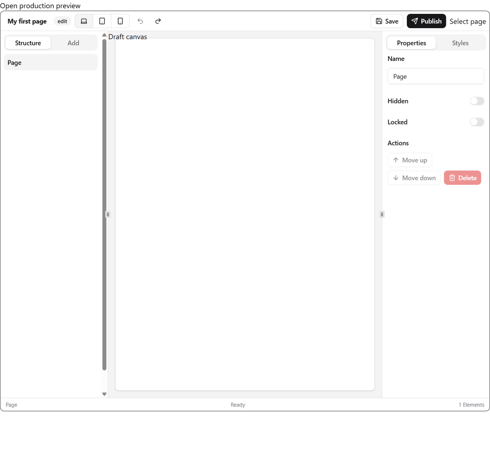

# Parity Phase 0 audit — evidence and acceptance fixtures

Status: accepted by the product owner. Date: 22 September 2026.

Source baseline: Quizr Page Builder V2 commit
`7dec26465c454b25545664e84d8e1e91b97ae9d1`.

## Outcome

The parity program now has a concrete, testable acceptance contract rather than
a general instruction to make the editor resemble Quizr.

- 70 stable acceptance cases cover the shell, canvas, Structure, inspectors,
  design, Elements, libraries, media, styling engine, lifecycle, Runtime,
  installation, accessibility and failure states.
- 11 complete interaction traces define the packed-package journeys that must be
  demonstrated rather than inferred from unit tests or idle controls.
- 15 required visual states and six fixed viewports define screenshot evidence,
  including exact shell-boundary probes.
- The Reference Host contract defines source and authoritative packed modes,
  default-route purity, direct-link states, realistic local Adapters, seed data
  and required browser evidence.
- Three neutral target Documents freeze the deeply designed page, all 24
  standard Element types and the responsive/stateful styling model.
- The root quality gate now checks fixture neutrality and structural integrity.

Parity Phase 1 has not begun.

## Acceptance artifacts

- [Parity acceptance index](../parity/README.md)
- [Acceptance cases](../parity/acceptance-cases.md)
- [Interaction traces](../parity/interaction-traces.md)
- [Visual matrix](../parity/visual-matrix.md)
- [Reference Host contract](../parity/reference-host-contract.md)
- [Target Document fixtures](../../../../fixtures/parity/README.md)
- [Quizr source-of-truth study](../../../research/quizr-page-builder/README.md)

## Package-native fixtures

| Fixture                           | Elements | Purpose                                                         |
| --------------------------------- | -------: | --------------------------------------------------------------- |
| `project-enquiry.document.json`   |      132 | Neutral deep-page design corresponding to the staging evidence. |
| `all-elements.document.json`      |       24 | Exact target standard Element inventory and defaults.           |
| `responsive-states.document.json` |        2 | Deterministic breakpoint, state, Class and Variable probe.      |

The fixtures use `format: "pagebldr"`, target `schemaVersion: 2`, deterministic
IDs and neutral content. They deliberately fail the current package's
future-schema guard until Parity Phase 1 introduces the target Document schema;
they are acceptance targets, not compatibility fixtures smuggled into the
version-1 model.

`scripts/check-parity-fixtures.mjs` proves:

- exactly three target Documents exist;
- no Quizr format/product vocabulary exists in their serialized data;
- roots, references, single-parent ownership, connectivity and ordered maps are
  structurally coherent;
- the all-Elements fixture contains exactly the 24 target types; and
- the deep fixture retains exactly 132 Elements.

## Current Reference Host baseline

The existing source-linked Vite development server was opened through the T3
Code embedded browser at `http://localhost:5173/`.

Observed CSS viewport: 1098 × 1020. The saved image is 1280 × 1189 device
pixels.

The baseline proves the current application is not the required installed
experience:

- it starts with one root Element and an empty canvas;
- Structure and the inspector are fixed sidebars;
- the default route injects custom `Select page`, notes, canvas-label and status
  Contributions;
- Content editing is a generic Properties tab;
- Styles is a placeholder rather than an authoring surface;
- Blocks, Templates, media, Page design, Preview, History and lifecycle states
  are not available; and
- it consumes workspace packages rather than a freshly installed tarball.

The initial snapshot reported only Vite connection debug entries and no console
errors. T3 preview resize timed out at both 15 and 60 seconds, and subsequent
snapshots returned an automation execution error. This limitation prevented
additional current-state tablet/phone captures. The required future viewports
are fixed in the visual matrix; no parity implementation was claimed or waived
because of the tooling failure.

## Changed interfaces and decisions

No published package interface changed.

Stable domain language and product requirements now define:

- **Default experience** as the complete installed, styled package product; and
- **Reference Host** as the packed public-package visual and interaction
  acceptance surface rather than a disposable example.

The product specification, owner decisions and README record those decisions.
The earlier non-goal excluding Revision UI was corrected: the package owns the
standard UI when a Host supplies lifecycle capabilities, while a hosted Revision
service remains out of scope.

## Verification

- `pnpm parity:fixtures:check` — passed: three neutral Documents and 24 standard
  Element types.
- T3 Code embedded-browser load and semantic/screenshot snapshot — passed at the
  available fill viewport.
- T3 Code resize to 1440 × 900 — unavailable after 15-second and 60-second
  automation timeouts.
- Follow-up T3 Code snapshot after tab interactions — unavailable due to a
  preview automation execution error.
- `pnpm check` — passed: formatting, lint, TypeScript, 57 package tests,
  documentation checks/spelling, fixture integrity, all builds, package/public
  export analysis, isolated packed-consumer installation and hydration, and
  dependency licences. The first two runs stopped at lint because the new
  checker initially used undeclared `console` and then `process` globals; the
  final implementation imports `node:process` and the complete gate passed.
- `git diff --check` — passed.

## Risks and deferred work

- Packed Reference Host mode and its purity checker are specified but are not
  implemented in Phase 0; they evolve with the first observable package work.
- Target schema version 2 is intentionally unsupported until Parity Phase 1.
- The deeply designed target fixture freezes data and hierarchy, not a claim
  that current Elements can render it.
- Screenshot comparison automation is a later implementation concern; this phase
  fixes the states and judgment rule.
- No package feature implementation, deployment, publication, push or external
  system change occurred.

## Review gate

Product-owner review should confirm:

1. the 70 cases and 11 traces describe the product that must ship;
2. the Reference Host routes and purity rule make the installed experience
   auditable;
3. the six viewports and 15 visual states are sufficient evidence; and
4. the three target Documents are the correct fixtures for engine and standard
   library work.

Approval authorizes Parity Phase 1 only.
