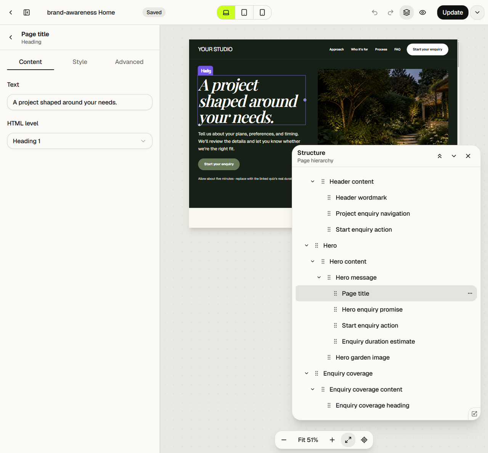
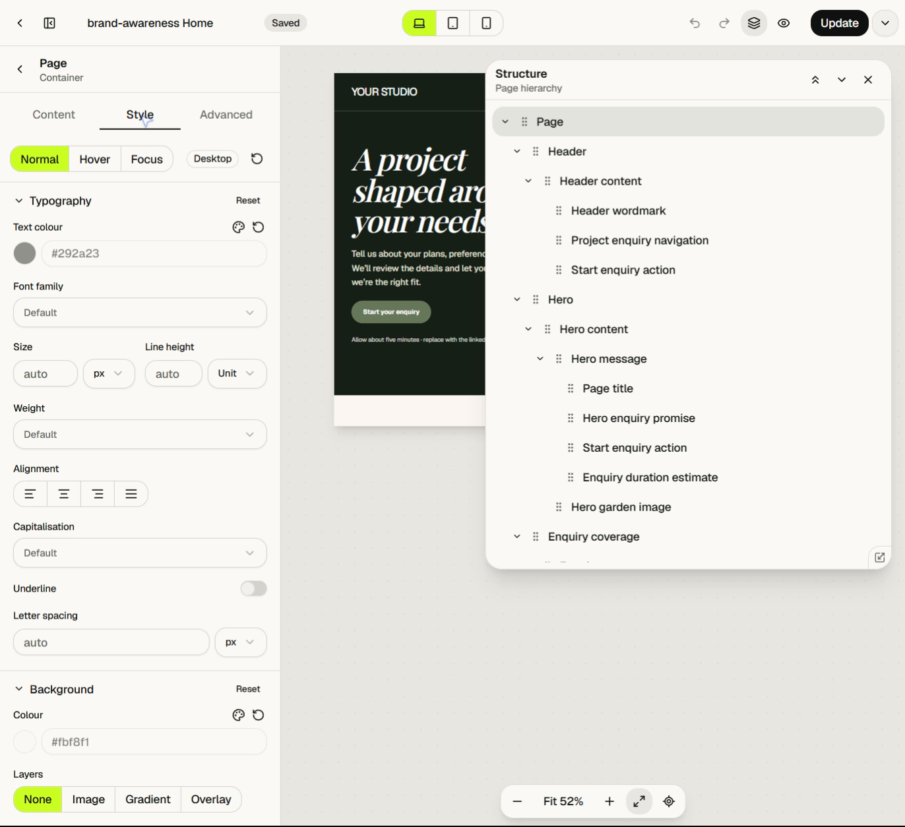
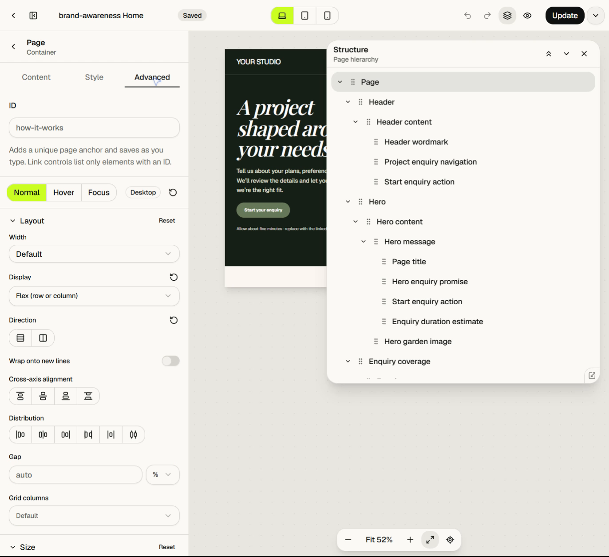
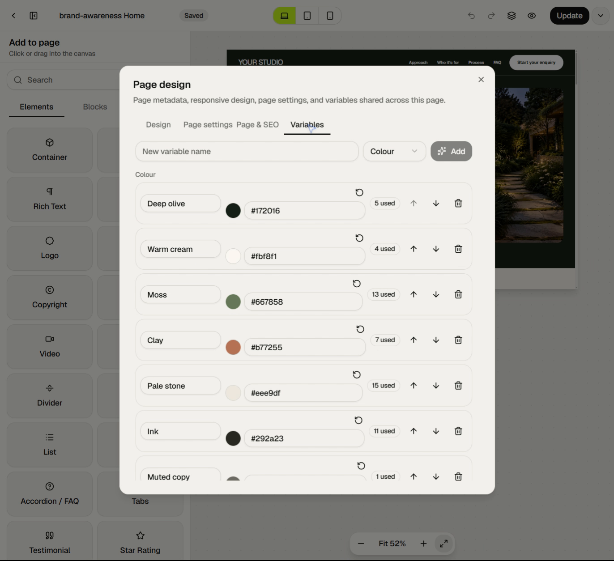

# Editor experience

## Shell anatomy

The editor is a full-height workspace with four persistent concepts: the top
action bar, the left library/inspector panel, the canvas workspace and the
Structure window.

### Top bar

On desktop the top bar contains:

- Exit editor.
- Toggle the left panel.
- Editable page title and Home marker.
- Save-state label: Saved, Unsaved/dirty, Saving, Failed or Conflict.
- Authored viewport controls: Desktop fixed width, Tablet and Mobile. Desktop
  can also operate in a fluid/fill canvas mode.
- Undo and Redo.
- Toggle Structure.
- Toggle Preview.
- Primary Publish or Update action. Managed-template editing replaces this with
  Save template.
- More publishing actions: Save draft, History, Page design, Open live page and
  Unpublish page when applicable.

On phone and tablet presentations, only the primary publish/update action stays
in the header. Undo, redo, preview, save draft, history, page design, rename,
open-live and unpublish move into **More editor actions**. Touch targets grow to
44 pixels.

The primary action says **Publish** for an unpublished page and **Update** for a
published page. It is disabled for read-only workspaces, active saves and
conflicts.

### Left panel

With no element selected, the panel is **Add to page**. It has one search field
across three tabs:

- **Elements**: the 24 registered primitives.
- **Blocks**: repository blocks followed by reusable blocks saved for the site.
- **Templates**: repository Featured templates and, when assigned,
  organisation-specific My templates.

Items can be clicked or dragged. Click insertion resolves a valid location from
the current selection. Drag insertion and tree moves show before/inside/after
targets and reject structurally invalid drops.

With an element selected, the panel changes into an inspector headed by the
element's authored name and type. Back returns to the library. The three
inspector tabs are Content, Style and Advanced.

On narrow editor layouts, the panel is initially closed and opens as a movable
overlay. A compact bottom toolbar exposes Add to page, zoom, Structure, authored
page view and panel collapse. Structure remains an independent overlay, so it
can coexist with the inspector.

## Canvas

The canvas is the same document renderer in editor mode, hosted inside an
isolated frame. It supports:

- click-to-select and hover synchronization with Structure;
- selection outline, type label and resize/selection affordances;
- inline editing for supported text elements, started by double-click or Enter;
- drag insertion and movement;
- an editor-only representation of hidden elements;
- disabled link navigation in both editing and editor preview;
- automatic reveal/scroll when a Structure node is selected; and
- postMessage coordination between the shell and the isolated canvas.

The fixed desktop canvas is centered on a dotted workspace. Tablet and Mobile
use simulated widths driven by the page's breakpoint settings. Desktop fill mode
uses the available workspace width.

### Zoom

Desktop exposes a floating zoom island with minus, current zoom, plus, fit and
scroll-to-selection. Numeric zoom is clamped from 25% to 200%. **Fit** derives a
scale from canvas width, available workspace height and presentation gutters,
never below 25% and never above 100%. Narrow layouts collapse the same controls
into a popover.

### Preview

Preview removes editor chrome below the top bar and renders the current local
document without selection or authoring interactions. It does not save or
publish. Escape or Return to editor restores editing. Link actions remain
disabled inside editor preview, avoiding accidental navigation away from unsaved
work.

## Structure

Structure is a resizable, movable hierarchy window rather than a fixed sidebar.
It provides:

- Page hierarchy title.
- Collapse all.
- Minimize/collapse.
- Close.
- Resize handle and move handle; double-clicking the move handle resets its
  position.
- Expand/collapse per container.
- Selection, hover and canvas reveal synchronization.
- Drag movement with valid before/inside/after feedback.
- Hidden, locked, responsive-hidden and broken-link indicators.

The tree action menu contains:

- Edit.
- Copy and Paste.
- Copy style and Paste style.
- Duplicate.
- Rename.
- Move up and Move down.
- Indent into previous and Outdent.
- Hide/Show.
- Lock/Unlock.
- Save as block.
- Delete.

Root restrictions are explicit: the root cannot be copied, duplicated, renamed,
moved, hidden, saved as a block or deleted. Locked elements cannot be mutated,
moved, duplicated or deleted until unlocked.

Keyboard navigation follows tree semantics. Arrow keys traverse and
expand/collapse. Alt+Arrow operations move, indent and outdent where valid.

## Inspectors

### Content

Content controls come from each element definition and use type-specific forms.
Examples include:

- text and semantic heading level;
- structured rich-text blocks;
- destination controls for buttons and menu items;
- media selection, alternative text, decorative/confirmed status, fit and focal
  position;
- ordered accordion, tab, list, social-link and gallery items;
- countdown date and expired label;
- progress value, label and display switches; and
- menu collapse behaviour, presentation, alignment and breakpoint-specific
  positioning.

Most text and numeric changes are dispatched with coalescing keys, so continuous
input becomes a sensible single undo action rather than one action per
keystroke.

### Style

Style is intentionally the high-frequency visual surface:

- element-specific controls such as Menu appearance, Logo treatment or Gallery
  layout appear first where applicable;
- Normal, Hover and Focus style-state controls;
- active authored breakpoint badge;
- reset all local styles;
- **Typography**: text colour, approved font family, size, line height, weight,
  alignment, capitalization, underline and letter spacing;
- **Background**: colour, none/image/gradient/overlay layers, sizing, position
  and repeat.

Every property can be reset to inherited. The UI indicates when a value comes
from a class or a wider breakpoint. Colour, spacing, radius, shadow, typography
and content-width fields can refer to page variables instead of literals.

### Advanced

Advanced contains the unique page anchor ID plus the lower-frequency capability
groups:

- **Layout**: width, display, direction, wrap, cross-axis alignment,
  distribution, gap and grid columns.
- **Size**: height, min/max width and height, overflow.
- **Spacing**: linked or independent margin and padding sides.
- **Border & radius**: width, style, colour and corner rounding.
- **Effects**: opacity, shadow, transform, filter, backdrop filter, transition
  and cursor.
- **Position**: normal/relative/absolute/fixed/sticky, four offsets and stack
  order.
- **Visibility**: independent hide switches for Desktop, Tablet and Mobile.

The panel only shows capabilities registered for the selected element. An anchor
ID must be a unique lowercase slug; link controls only list elements that have
one.

## Page design dialog

Page-level controls are separate from element controls:

- **Design**: content width, tablet maximum and mobile maximum, with
  reset-to-default actions. Live staging uses 1200, 1024 and 767 for the
  inspected page.
- **Page settings**: Show default header.
- **Page & SEO**: page title, search title and description, social title and
  description, managed social image and noindex.
- **Variables**: add, rename, edit, reorder and delete page variables; display
  usage count; filter new-variable kind.

Variable kinds are Colour, Typography, Spacing, Radius, Shadow and Content
width. In the inspected template the palette contains Deep olive, Warm cream,
Moss, Clay, Pale stone, Ink, Muted copy and White, plus a Content width
variable.

## Editor responsiveness

There are two independent responsive systems:

1. **Document responsiveness** uses the document's Desktop, Tablet and Mobile
   breakpoints. The toolbar switches authored declarations and canvas
   simulation.
2. **Editor-shell responsiveness** is based on the actual editor viewport:
   desktop at 1024px and above, tablet from 768px, phone below 768px.

Desktop uses a persistent 360px-class panel, floating Structure and full
toolbar. Tablet and phone use compact headers, bottom controls and movable
overlays. The page canvas remains zoomable and authorable; the narrow UI is not
a read-only preview.

## Keyboard shortcuts

Outside text inputs and editable text:

| Shortcut                       | Behaviour                                     |
| ------------------------------ | --------------------------------------------- |
| Ctrl/Cmd+Z                     | Undo.                                         |
| Ctrl/Cmd+Shift+Z or Ctrl/Cmd+Y | Redo.                                         |
| Ctrl/Cmd+C                     | Copy selected element subtree.                |
| Ctrl/Cmd+V                     | Paste at selected element.                    |
| Ctrl/Cmd+D                     | Duplicate selected element.                   |
| Ctrl/Cmd+I                     | Toggle Structure.                             |
| Delete or Backspace            | Delete selected element if allowed.           |
| Enter                          | Begin inline editing of the selected element. |
| Escape                         | Exit preview, otherwise clear selection.      |
| Alt+Arrow keys in Structure    | Move, indent or outdent.                      |

## Read-only, loading and recovery presentation

- Billing or permission policy can place the whole editor in read-only mode with
  an explanatory banner.
- Read-only mode preserves browsing, Structure, preview, history preview and
  visual inspection while disabling mutations.
- A server revision conflict pauses autosave and publish, preserves the local
  document and undo history, and offers retry/recovery instead of silently
  overwriting either version.
- Valid local recovery data is offered on load. The creator can recover or
  discard it; a server-revision mismatch deliberately resumes in conflict state.
- Loading, empty and failure states use named accessible primitives and keep the
  editor shell stable.
