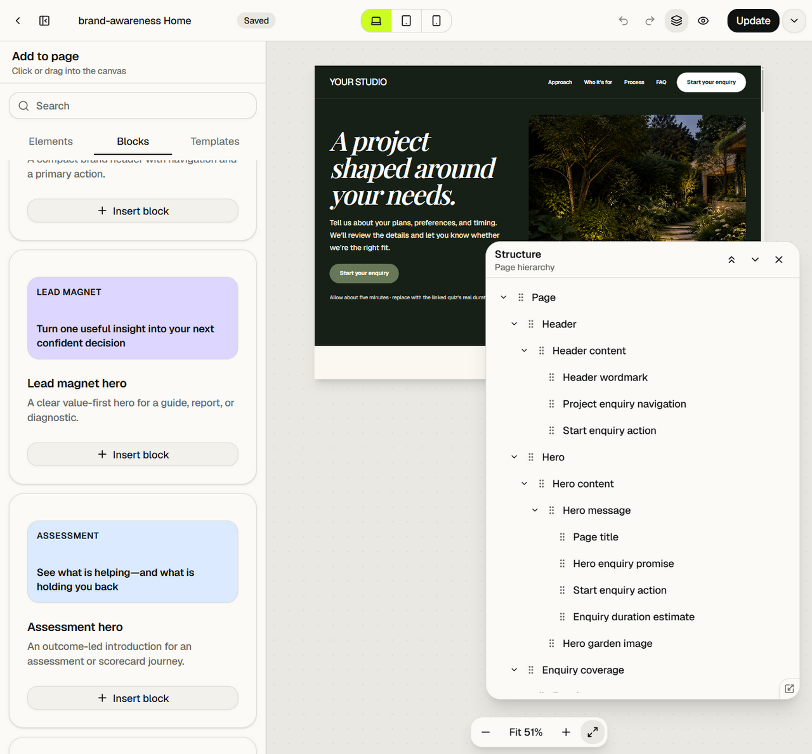
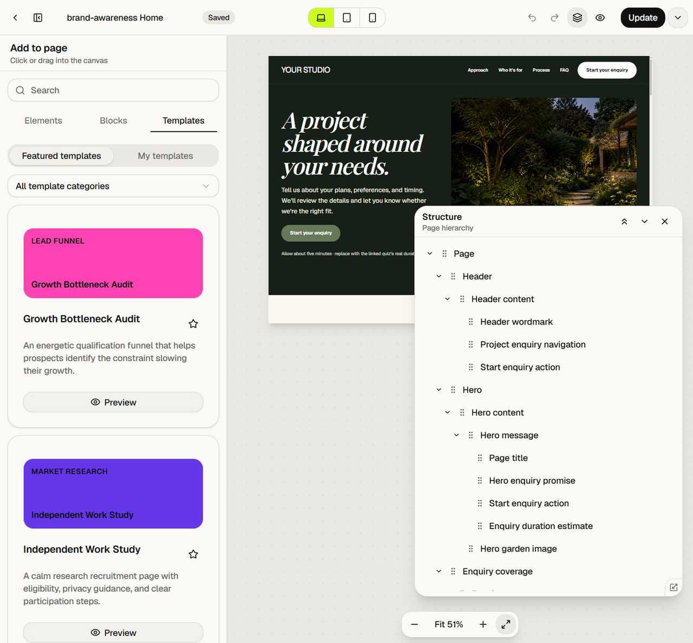

# Elements, blocks and templates

## Elements

Quizr exposes 24 element definitions. Each definition keeps together its
version, prop schema, defaults, child policy, supported style capabilities,
optional prop migrations and runtime renderer contract.

| Element               | Authored content and behaviour                                                                                                                                                                                                                                  | Runtime output / notable rules                                                                                        |
| --------------------- | --------------------------------------------------------------------------------------------------------------------------------------------------------------------------------------------------------------------------------------------------------------- | --------------------------------------------------------------------------------------------------------------------- |
| Container             | Semantic tag (`div`, `main`, `section`, `article`, `header`, `footer`, `nav`); flex or grid layout; accepts children.                                                                                                                                           | Chosen semantic wrapper; the only valid document root type. Supports every style capability.                          |
| Heading               | Text and H1–H6 level.                                                                                                                                                                                                                                           | Native heading element. Inline editing supported.                                                                     |
| Rich Text             | Ordered paragraph, heading, bullet-list and numbered-list blocks.                                                                                                                                                                                               | Semantic paragraphs/headings/lists; not arbitrary HTML.                                                               |
| Button                | Label and typed destination.                                                                                                                                                                                                                                    | Link/button treatment; editor navigation disabled.                                                                    |
| Logo                  | Text, image or image+text; source, alt, image before/after, gap, alignment, width and fit.                                                                                                                                                                      | Brand mark with accessible image treatment and layout options.                                                        |
| Menu                  | Accessible label, ordered destination items, collapse breakpoint or never, dropdown/fullscreen presentation, toggle label, panel styling, item gap/alignment, full-screen vertical alignment, underline/background appearance and breakpoint-specific position. | Responsive interactive menu widget; fixed overlay/panel where configured.                                             |
| Copyright             | Symbol, year, owner and suffix.                                                                                                                                                                                                                                 | Semantic copyright line.                                                                                              |
| Image v2              | Managed asset, external URL or built-in source; alt, alt-confirmed, decorative, optional destination, fit and object position.                                                                                                                                  | Resolved image; linked when a destination exists. Managed meaningful images must be confirmed before publish.         |
| Video v2              | Managed asset or external URL; managed presentation native/embed; title.                                                                                                                                                                                        | Native video, privacy-enhanced YouTube, Vimeo or supported direct media; unsupported external URLs become safe links. |
| Icon                  | Named icon and accessible label. Names: sparkles, activity, check, arrow-right, star, heart, shield, target, users, chart, clock, mail and play.                                                                                                                | Configured icon; decorative when label is blank.                                                                      |
| Divider               | No authored content.                                                                                                                                                                                                                                            | Decorative separator.                                                                                                 |
| Spacer                | No authored content.                                                                                                                                                                                                                                            | Layout space controlled through styles.                                                                               |
| List                  | Ordered switch and authored text items.                                                                                                                                                                                                                         | Native ordered/unordered list.                                                                                        |
| Icon List             | Icon/text pairs.                                                                                                                                                                                                                                                | Repeated semantic list rows with icons.                                                                               |
| Accordion / FAQ       | Allow-multiple switch and question/answer items.                                                                                                                                                                                                                | Native `details`-style accessible disclosure behaviour.                                                               |
| Tabs                  | Label/content items.                                                                                                                                                                                                                                            | Client interactive tab widget with active-state management.                                                           |
| Testimonial           | Quote, author, role and optional image.                                                                                                                                                                                                                         | Quotation/social-proof composition.                                                                                   |
| Star Rating           | 0–5 rating in half-star steps and label.                                                                                                                                                                                                                        | Accessible visual rating.                                                                                             |
| Counter               | Numeric value, prefix, suffix and label.                                                                                                                                                                                                                        | Number/statistic presentation.                                                                                        |
| Progress v2           | 0–100 value, label, show-label/show-value, track and indicator colours, thickness and radius.                                                                                                                                                                   | Accessible progress semantics with configured visual track.                                                           |
| Countdown             | Target date/time and expired text.                                                                                                                                                                                                                              | Client widget updates over time and swaps to the expiry message.                                                      |
| Social Links          | Ordered platform, label, URL and new-tab items. Platforms: LinkedIn, Instagram, Facebook, YouTube, X, website.                                                                                                                                                  | Accessible external-link collection.                                                                                  |
| Logo Cloud            | Label and ordered logos with name, source and alt.                                                                                                                                                                                                              | Responsive trust-logo collection.                                                                                     |
| Gallery / Carousel v2 | Square, masonry or carousel layout; ordered image/video items; source, per-usage alt/confirmation/decorative state and caption.                                                                                                                                 | Grid, CSS-column masonry or interactive carousel; viewer support; only active carousel video plays.                   |

Every element can also carry a unique optional anchor ID. Structure-level name
is editorial metadata and is not rendered publicly.

### Typed destinations

Buttons, menus and linked images do not store an untyped href. Destinations are:

- Quiz: quiz object ID, resolved to that published quiz or the site's default
  quiz policy.
- External: URL and open-in-new-tab flag.
- Anchor: target element ID, resolved to its authored anchor or generated
  `qb-{elementId}` fallback.
- Email: address and optional subject.
- Telephone: number.

Broken or missing references are surfaced in Structure and block publication
where policy requires it.

## Blocks

Blocks are ordinary clipboard subtrees created by repository definitions.
Insertion remaps IDs and adapts class/variable references to the current
document. There is no `block` runtime element.

The live catalogue contains 23 blocks:

| Block                      | Category           | Composition intent                                         |
| -------------------------- | ------------------ | ---------------------------------------------------------- |
| Simple navigation          | Header             | Logo, navigation destinations and primary action.          |
| Lead magnet hero           | Hero               | Value-first guide/report/diagnostic introduction.          |
| Assessment hero            | Hero               | Outcome-led assessment or scorecard introduction.          |
| Recommendation hero        | Hero               | Recommendation/solution-finder introduction.               |
| Consultation hero          | Hero               | Trust-led qualification and consultation introduction.     |
| Event hero                 | Hero               | Event or webinar registration introduction.                |
| Waitlist hero              | Hero               | Early-access/waitlist introduction.                        |
| Newsletter hero            | Hero               | Audience and newsletter/research growth introduction.      |
| Problem and solution       | Problem / solution | Heading/copy plus tabs contrasting problems and solutions. |
| Benefits and features      | Benefits           | Responsive benefit grid.                                   |
| How it works               | Steps              | Numbered process steps.                                    |
| Assessment explanation     | Explanation        | Media-led explanation with video.                          |
| About and authority        | Authority          | Editable authority copy and gallery.                       |
| Logo and trust strip       | Trust              | Responsive logo cloud.                                     |
| Statistics                 | Social proof       | Responsive counter grid.                                   |
| Featured social proof      | Social proof       | Star rating and featured testimonial.                      |
| Testimonial grid           | Testimonials       | Three editable testimonials in a responsive grid.          |
| Pricing and comparison     | Comparison         | Two paths/options with benefit lists and actions.          |
| Frequently asked questions | FAQ                | Multi-item accordion.                                      |
| Mid-page call to action    | CTA                | Compact narrative-break action.                            |
| Event countdown CTA        | CTA                | Countdown plus time-sensitive action.                      |
| Final call to action       | CTA                | Decisive closing action.                                   |
| Footer and disclaimer      | Footer             | Footer menu, social links, copyright and legal copy.       |

Block cards carry a colour thumbnail, eyebrow, summary, description and **Insert
block** action. Category filtering and the common search field narrow the list.

### Saved blocks

Any non-root subtree can be **Saved as block** from Structure. Saved blocks are
site-scoped, store the validated clipboard payload, have a creator-supplied name
up to 80 characters, and can be inserted or deleted from the library. A site can
hold at most 50. They are not globally shared and do not retain a live
connection to their source elements.

## Templates

Templates produce complete ordinary documents. Applying one:

- validates and clones the template;
- remaps IDs and references;
- replaces the current page structure, classes, variables, settings and design;
- preserves the current document ID, page title, slug and SEO identity fields;
- selects the resulting root and returns zoom to Fit; and
- does not keep a relationship to the template for future updates.

### Featured templates

| Template                | Category                   | Description / visual intent                                                                                        |
| ----------------------- | -------------------------- | ------------------------------------------------------------------------------------------------------------------ |
| Growth Bottleneck Audit | Lead Funnel                | Energetic qualification funnel; hot pink/coral/mint palette; helps prospects identify a growth constraint.         |
| Independent Work Study  | Market Research            | Calm research-recruitment page; violet/blue/orange/green palette; eligibility, privacy and participation steps.    |
| Business Health Index   | Lead Funnel                | Restrained editorial scorecard; bone/black/acid-lime palette; consultancy/fractional-executive diagnostic.         |
| Business Pulse          | Lead Funnel                | Bold business diagnostic; blue/orange/yellow palette; one clear priority and next move.                            |
| Solution Fit Finder     | Lead Funnel                | Calm recommendation journey; blue/coral/green palette; matches a prospect to an offer.                             |
| Project Fit Enquiry     | Structured Data Collection | Editorial project-qualification page; olive/cream/moss/clay palette; the design open in staging during this study. |

Each definition supplies ID, name, category, description, search tags, thumbnail
metadata and a function that creates a fresh validated document. The template
source includes authored anchor navigation, variables, classes, responsive
styles, semantic elements and SEO defaults.

### Template library interaction

- Search spans name, description, category and tags.
- Category filters are derived from the available catalogue.
- Favourites are client-side preferences exposed as a star action.
- Preview opens a read-only full-document renderer. It does not apply the
  template.
- Applying is an explicit action from preview/library and remains disabled in
  read-only mode.
- When assigned managed templates exist, the library shows **Featured
  templates** and **My templates**. If none are assigned, it shows the featured
  catalogue directly without an empty My templates tab.

### Managed templates

Managed templates are persisted separately from pages and administered by
platform administrators. Each has metadata, a validated V2 document, optimistic
revision, timestamps/editor and explicit organisation assignments.

Server filtering ensures an organisation receives only templates assigned to it.
One managed template may be assigned to zero, one or many organisations. An
unassigned template remains editable in platform administration but is absent
from every organisation builder.

Managed-template editing reuses the editor through a different persistence
adapter. It exposes **Save template**, not page publish/unpublish. Applying a
managed template clones it through the same ordinary-document path as Featured
templates.

The source also contains a Leverage Quotient managed-template document intended
for import. It is not part of the six repository Featured templates and is not
automatically visible to organisations.

## Library insertion rules

- Click insertion targets the selected container when valid, otherwise an
  appropriate parent/sibling location.
- Drag insertion exposes valid target placement visually.
- Definitions may use the site's first/default quiz ID when seeding CTA
  destinations.
- All generated IDs come from the V2 ID factory and are adapted again at
  paste/apply boundaries.
- Inserted content is immediately ordinary editable content. All subsequent
  changes use the same commands as hand-created elements.
