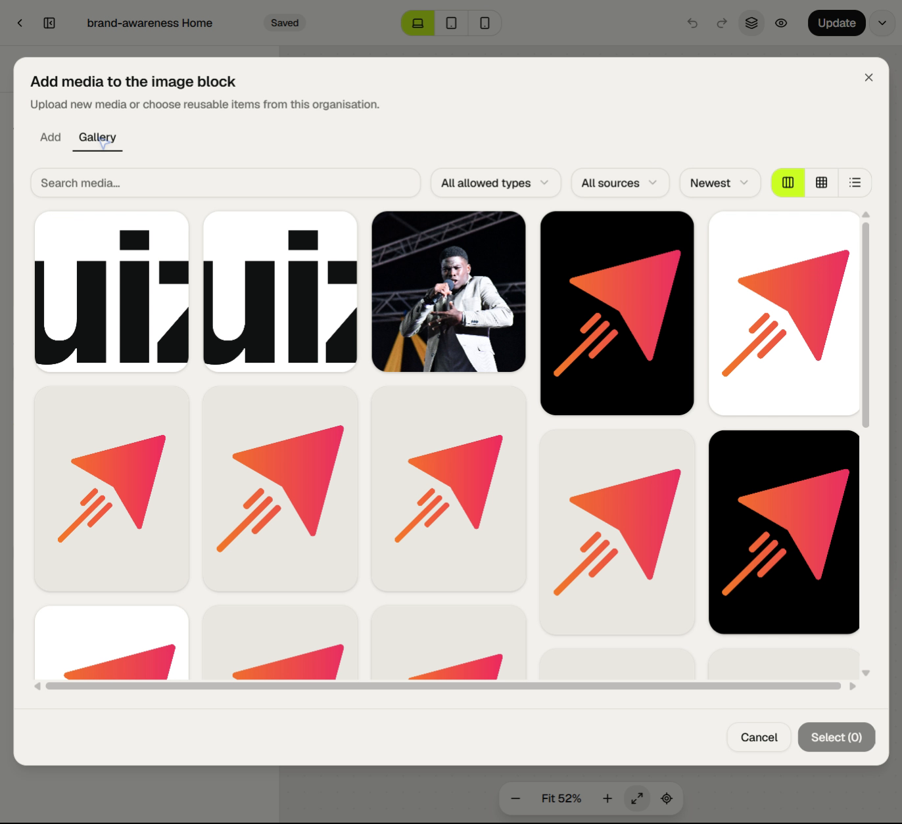

# Media and runtime

## Shared media integration

Page Builder V2 does not own uploaded files. It consumes Quizr's organisation
media library through asset IDs and resolver callbacks. The page document owns
only the reference and per-usage presentation/accessibility data.

### Picker contract

The shared picker is one responsive accessible dialog with Add and Gallery tabs
and a persistent footer. Each invocation supplies:

- allowed kinds;
- single or multiple cardinality;
- existing selected IDs;
- maximum resulting count;
- a context label; and
- usage-specific accessibility policy.

Closing, Escape, overlay dismissal or Cancel discards pending selection.
**Select (n)** is the only commit action and is disabled at zero.

### Add tab

- Drag/drop or browse up to ten files.
- Accepted files start uploading automatically.
- Stable queue cards show numeric and perimeter progress.
- Active uploads can be cancelled; failures can be retried or removed.
- Completed uploads join the organisation library and become pending picker
  selections, but are not attached to the element until Select is pressed.
- The organisation-scoped upload queue survives picker tab changes, picker
  closure and mounting the Media page elsewhere in the same application session.
- An External URL input detects kind, validates HTTPS and respects the invoking
  surface's allowed kinds.

The live image invocation displayed PNG, JPG, WebP and GIF support, a ten-file
limit and an External URL alternative.

### Gallery tab

- Search display name, immutable original filename, extension and external host.
- Filter type and source (uploaded/external).
- Sort newest, oldest and name ascending/descending.
- Masonry, grid and list presentation controls.
- Responsive virtualized cards with image thumbnails, video posters/play state,
  the Quizr waveform for audio and typed fallbacks for documents/unavailable
  media.
- Single selection replaces the pending choice. Multi-selection keeps click
  order, ignores duplicates and respects the maximum.
- Preview opens the shared viewer without changing pending selection.

The intended responsive card density is approximately five desktop columns,
three tablet and two phone, adjusted to card minimums. Virtualization renders
the viewport plus roughly a half-viewport buffer and prefetches before that
buffer is exhausted.

### Page-builder policies

| Surface            | Allowed         | Cardinality / limit | Stored result                                                                          |
| ------------------ | --------------- | ------------------- | -------------------------------------------------------------------------------------- |
| Image              | Image           | One                 | Managed asset source plus per-usage alt/decorative/confirmed state.                    |
| Video              | Video           | One                 | Managed asset source and native/embed presentation; external remains a secondary path. |
| Gallery / Carousel | Image and video | Many, 30 total      | Ordered typed items appended without duplicate asset IDs.                              |
| Page social image  | Image           | One                 | `settings.seo.socialImageAssetId`.                                                     |

When a managed image is first selected, its display name initializes the usage
alt text and confirmation remains false. The creator must edit/confirm
meaningful text or mark that usage decorative before publishing. A single asset
used in two places therefore has two independent accessibility decisions.

Gallery items can be manually reordered and removed. Each image item owns alt,
confirmed and decorative values; each item can own a caption. Layout
selection—Square, Masonry or Carousel—is a Style-tab element-specific control.

## Media viewer

The shared full-screen dialog gives the asset visual priority and stops playback
on close:

- images fit without distortion;
- video and audio use native controls and never autoplay;
- audio uses the Quizr waveform;
- PDF, TXT and CSV preview with a Download action and bounded escaped text;
- DOCX, XLSX and PPTX download rather than embed; and
- unavailable assets retain typed identity/status and cannot be newly selected.

The page-builder Gallery opens this viewer. Carousel playback is constrained to
the active slide and pauses when the slide changes.

## Shared renderer

`PageBuilderV2Runtime` is used in three places:

- editor canvas/editor preview with mode `editor` or `preview`;
- durable revision preview with mode `public`; and
- published page runtime with mode `public` and Host-supplied resolvers.

The renderer first migrates and validates the document, compiles document CSS
and injects the interactive-widget CSS. It recursively renders from `rootId` and
omits unknown or hidden nodes in public mode. Unknown elements become a visible
alert placeholder in the editor so authors can recover rather than lose sight of
invalid content.

### Editor versus public mode

| Concern             | Editor / preview                        | Public                          |
| ------------------- | --------------------------------------- | ------------------------------- |
| Selection and hover | Enabled in editor; disabled in preview. | None.                           |
| Hidden element      | Kept discoverable/editor-marked.        | Omitted.                        |
| Link navigation     | Suppressed.                             | Resolved and active.            |
| Unknown element     | Error placeholder.                      | Omitted.                        |
| Asset resolution    | Editor resolver/placeholder.            | Host public media URL/resolver. |
| Quiz links          | Non-navigating representation.          | Published quiz path.            |

### Link resolution

- Quiz destinations resolve through a supplied quiz-path callback and only
  published quizzes are offered by the public route.
- Anchor destinations use the target element's authored anchor ID or the
  generated `qb-{elementId}` anchor.
- Email and telephone values are normalized to their URI schemes.
- External links retain their new-tab intent with appropriate rel treatment.
- Legacy placeholder Quizr domains are recognized and mapped to the default quiz
  where required by the current Host integration.

### Video resolution

- YouTube is transformed to its privacy-enhanced embed host.
- Vimeo is embedded.
- Direct MP4, WebM and Ogg links use native video.
- Other external video URLs render as safe outbound links.
- Managed assets use their declared native/embed presentation and Host resolver.

### Interactive widgets

The tabs, countdown, responsive menu and gallery/carousel are client widgets
layered on the otherwise shared declarative renderer.

- Tabs manage active tab and associated panels.
- Countdown updates time remaining and renders expired text at zero.
- Menu chooses expanded/collapsed presentation from its configured breakpoint,
  not just generic CSS visibility.
- Gallery implements square grid, natural-aspect CSS-column masonry and
  carousel. It coordinates viewer state and video pause behaviour.

The remaining elements render semantic HTML without requiring a client state
machine: headings, paragraphs/lists, links, images, progress, disclosures,
testimonials, counters, dividers and containers.

## Public route and publication lookup

The current Quizr Host mounts V2 at the site's public root route, including
custom-domain rewrites. The route:

1. resolves the site/domain and its SitePage record;
2. loads the published V2 document only when `v2IsPublished` is true;
3. migrates/validates that published snapshot;
4. resolves only public/published quiz destinations and public asset URLs;
5. derives page metadata from the published document's SEO settings;
6. optionally surrounds the page with the site's default header according to
   `showDefaultHeader`;
7. includes the Host legal footer and view tracking; and
8. renders the shared runtime.

The draft is never substituted for the published document at request time. An
unpublished V2 page is not publicly rendered just because a valid draft exists.

## Responsive public rendering

The CSS compiler writes desktop base rules and max-width tablet/mobile rules
using the document's configured breakpoints. Responsive visibility and
menu-collapse behaviour therefore travel with the document rather than depending
on editor viewport assumptions.

Content width is exposed as a page-level CSS value and can also be referenced by
Content width variables. Images, video, grids, containers and galleries respond
through their compiled styles and element-specific runtime rules.

## Metadata and shell

SEO data comes from the published snapshot:

- search title and description;
- social title/description with search fallbacks;
- managed social-image asset;
- noindex directive; and
- page title/slug identity.

Site chrome is Host-owned. `showDefaultHeader` asks the Host route to show or
hide its default brand header; the page document may also contain authored
header/footer containers like any other elements.
