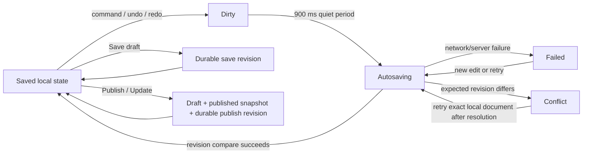
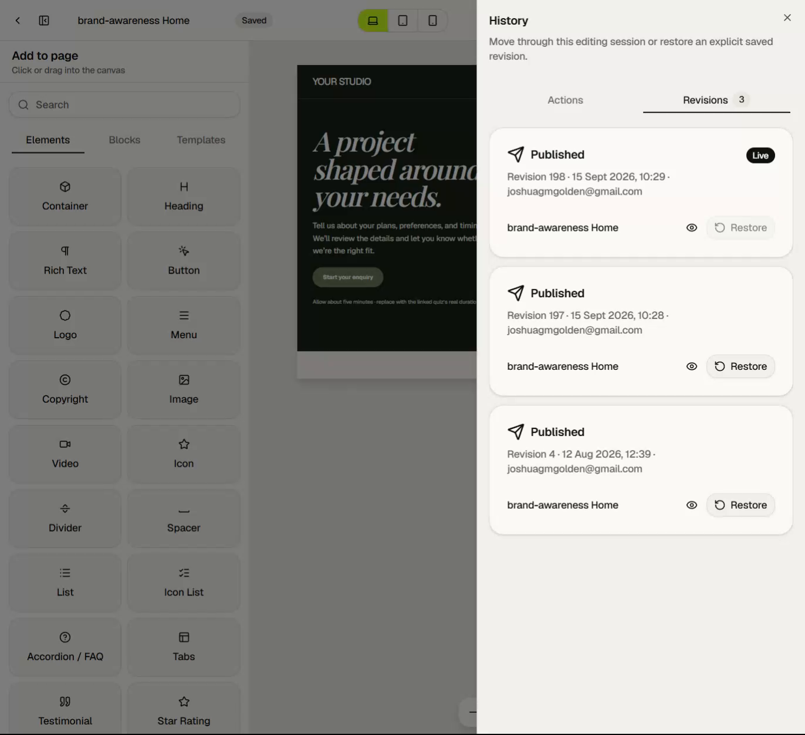

# Persistence, history and publication

## Stored page record

During Quizr's V1→V2 transition, the SitePage record contains legacy fields plus
the V2 lifecycle fields. The important V2 concepts are:

- current draft document;
- monotonically increasing server revision;
- published document snapshot;
- published revision and publication flag;
- last-saved and published timestamps/actors;
- draft and published resource references; and
- site-scoped saved-block payloads.

Durable `SitePageRevision` rows store explicit revision snapshots with kind
`save`, `publish` or `restore`.

## Editor load

The editor route resolves organisation/site authorization and billing policy,
then loads `sitePageV2.getForSite`. The workspace creates a controlled editor
store with:

- validated/migrated document;
- server revision;
- published status;
- read-only status and reason; and
- local history initialized at the loaded document.

If there is no V2 draft, server initialization creates or migrates a valid
initial V2 document according to Quizr's cutover policy. The editor never starts
from unvalidated arbitrary JSON.

## State model

## Autosave

Autosave begins after 900ms without another local document change.

- Only one request is in flight at a time.
- The request contains the whole validated document and expected server
  revision.
- The transaction updates the draft only if the expected revision matches, then
  increments the server revision and writes last-save metadata and draft
  references.
- Changes made while a request is in flight remain dirty and trigger the next
  save after the current request completes.
- A successful save marks the store Saved only when the saved local revision
  still equals the store's current local revision.
- Autosave does **not** create a durable revision card.

The top bar label reports this state independently of published status.

## Explicit Save draft

Save draft uses an operation UUID for idempotency and the same optimistic
revision compare. On success it:

- writes the current draft;
- increments the server revision;
- refreshes draft references and save metadata; and
- creates a durable revision of kind `save`.

Quizr retains the newest 50 revision snapshots while protecting the currently
published revision from retention cleanup. The API may fetch one extra row to
enforce the retention boundary correctly.

## Publish and Update

The same primary action is labelled Publish for an unpublished page and Update
for an already-published one.

Before mutation, publication validation checks:

- document and registry validity;
- missing/broken quiz destinations;
- links to unpublished quizzes, which require explicit confirmation to publish
  anyway; and
- every managed meaningful image usage, which must have confirmed alt text or be
  marked decorative.

The publish transaction:

1. compares the expected draft revision;
2. writes the submitted document as the current draft;
3. writes the same document as the immutable published snapshot;
4. increments the server revision and records it as published revision;
5. sets publication state/timestamps/actor;
6. replaces draft and published resource references;
7. creates a durable revision of kind `publish`; and
8. emits the page-published domain/outbox event and activity/audit record.

Publication is therefore atomic with the durable snapshot and revision. The
public route cannot see a partially updated draft/published pair.

## Unpublish

Unpublish is an explicit destructive menu action. It:

- clears the published document, published revision, flag and publication
  metadata;
- removes/replaces published resource references;
- emits the unpublish domain event/activity; and
- leaves the current draft intact.

The author can continue editing and later publish the preserved draft again.

## History: Actions versus Revisions

The History sheet makes the distinction visible.

### Actions

Actions are the local patch history for this editor session. **Opened editor**
is position zero; each recorded command is another position. Choosing one jumps
the local document backward or forward and makes it dirty. These actions
disappear when a fresh server document replaces the store or the session ends.

### Revisions

Revisions are server snapshots created only by Save draft, Publish and Restore.
Each card shows:

- kind label and icon;
- revision number;
- localized date/time;
- actor identity;
- page title;
- Live badge when it is the published revision;
- read-only preview; and
- Restore action when allowed.

The staging page had three retained published revisions: 198 (Live), 197 and 4.
This observation is evidence about that page, not a general retention sequence.

Revision preview loads the saved document and renders it through the public-mode
runtime in a read-only dialog. It does not replace the editor document.

## Restore

Restore requires the current draft to be Saved. If local work is unsaved, the UI
pauses restore and instructs the author to save first.

After confirmation, the server:

- uses operation UUID idempotency;
- checks expected current server revision;
- loads and validates the selected revision snapshot;
- writes it as a **new current draft head** with a new revision number;
- creates a durable revision of kind `restore`; and
- leaves the live published snapshot unchanged.

This is append-only history semantics. Restore never rewrites old revision rows
and does not silently roll the live page backward. A separate Publish is
required to make the restored design live.

## Conflicts

Every draft save/publish/restore that can replace current state carries an
expected revision. If another session has advanced the record, Quizr returns a
conflict rather than last-write-wins.

The editor then:

- marks save state Conflict;
- stops automatic attempts that could overwrite the newer server head;
- preserves the full local document and local undo/redo history;
- preserves a local recovery payload;
- allows the local document to be downloaded as recovery JSON; and
- retries the exact local revision only through the explicit recovery flow.

Publish remains paused during conflict. Failure and conflict are separate
states: an ordinary failure can retry; a revision conflict requires deliberate
resolution.

## Local recovery

Unsaved work is mirrored to local storage under:

`quizr:page-builder-v2:recovery:v1:{siteId}`

The payload contains the document, server revision and save timestamp. It is
validated/migrated before use and removed once the matching local revision is
durably saved.

On a later load:

- invalid recovery is ignored/removed;
- valid recovery can be discarded or recovered;
- matching server revision resumes as dirty local work; and
- differing server revision resumes in Conflict so neither side is silently
  lost.

## Idempotency and transaction boundaries

Explicit mutations use operation IDs so retrying after a lost response does not
create duplicate revision/event side effects. Draft/published snapshots,
revision rows, references and outbox/domain event records are written within the
operation's required transaction boundary.

Autosave intentionally has a lighter contract: it advances the draft and
revision safely but does not create a durable Revision or publication event.

## References and lifecycle coupling

Reference extraction walks typed element props and page settings to collect:

- quiz destinations; and
- media assets used by image, video, logo, gallery/carousel and social-image
  settings.

Draft and published references are tracked independently. Media availability and
reference counts can therefore distinguish “used in a draft” from “used by the
live page,” and trash/deletion policy can accurately warn about impact.

## Read-only policy

Authentication, authorization, organisation/site scope and billing live outside
the document engine. The Quizr route decides whether the editor is mutable and
passes read-only state into the same shell. Server mutations repeat
authorization and billing checks; disabling UI controls is not the security
boundary.

Managed-template persistence uses its own optimistic revision adapter and does
not expose page publication actions.
